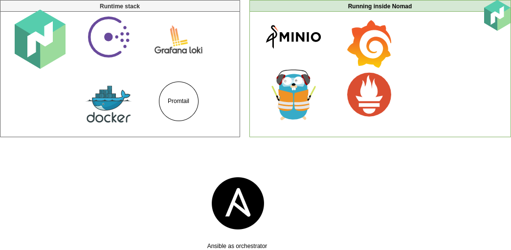

# Hashi in a box

The hashi in a box solution is a solution meant to provide teams a quick container/native/vm runtime enviroment.
The goal is as following:

* Use the hashicorp toolset to provide
  * Service discovery/mesh
  * Runtime environment for vm/containers/native/springboot
* Secure and transparant routing
* Auditability and logging out of the box, with minimal adjustments needed
* Monitored environment

The initial phase of this project will be focussed on Azure deployment.

# Table of contents

- [Hashi in a box](#hashi-in-a-box)
- [Table of contents](#table-of-contents)
- [Architecture](#architecture)
- [Native component list](#native-component-list)
- [Containerized component list](#containerized-component-list)
- [Hashicorp Nomad](#hashicorp-nomad)
  - [Networking](#networking)
  - [Integrations](#integrations)
    - [Consul](#consul)
    - [docker (and plugins)](#docker-and-plugins)
- [Hashicorp Consul](#hashicorp-consul)
  - [Networking](#networking-1)
  - [Key/value](#keyvalue)
- [Docker](#docker)
- [Promtail](#promtail)
- [Grafana loki](#grafana-loki)
- [Grafana](#grafana)
- [Minio](#minio)
- [Prometheus](#prometheus)
- [traefik](#traefik)


# Architecture

When deploying we need minimum 4 vm's (3 admin, 1 worker).

The applicative high level overview is following:



In the setup the runtime stack runs natively on the Linux system, they provide the base for the nomad runtime and observability around it.


# Native component list

There is a dual stack deployment of base components, the native installation and the Nomad job setup.
We will first list and discuss the native components:

* Hashicorp Nomad
* Hashicorp Consul
* Docker runtime
* Promtail 
* Grafana Loki

# Containerized component list

* Grafana
* Minio
* Prometheus
* Traefik

# Hashicorp Nomad

> Dependency: Docker, Consul

Nomad is used as runtime for the environment, it has 3 masters and 3 clients. By default we setup 2 namespaces:

* admin: The namespace containing all administrative tools
* client: The namespace used for applications, client deployments.

The namespaces are defined in the `nomad_namespaces` variable, set to `["admin", "client"]` in the defaults.

Nomad is masters are configured to expect 3 nodes for a full bootstrap to be successfull.
Clients are configured on all nodes, and get the meta tag `admin` set to `1` when the node is an admin node.

**telemetry**  is enabled by default, we enable prometheus metrics and set the collection interval to 1s.

## Networking

All server bind addresses are limited to the `vm_ip` variable set in the `host_vars/host` inventory. 
The client configuration uses the `network_cidr` variable for binding and defaults to `10.42.0.0/24` as defined in `group_vars/nomad/all.yml` in the inventory.

## Integrations

### Consul

The consul integration is non-optional and is set to use `local_ip:8500` as consul_address.
Nomad uses the standard integration, meaning that all services defined in jobs will be part of the consul_catalog.


```hcl
  create_from_role = "nomad-server"
  token = "{{ nomad_token.auth.client_token }}" 
}
```

### docker (and plugins)

Docker is configured in the `playbooks/roles/nomad/templates/nomad.hcl.j2` template and enables following:

* volumes, with selinuxlabel `z`
* garbage collection
* allow privileged containers
* set extra labels on containers

We also enable the loki docker plugin in case this is not an arm64 platform.

# Hashicorp Consul

> Dependency: None

Consul is used for service mesh and also internal dns server.

Consul is setup without namespaces, as this is an enterprise option that we did not get for this deployment.

Consul has 1 datacenter and this is configured in the `consul_dc_name` variable configured in `group_vars/consul_node/all.yml`, this dc name is used for multiple purposes outsite consul as well: 

* filename generation for consul certificates
* CA certificate

We enabled **Consul Connect** in case this will be used in the jobs.
UI is enabled by default.

Consul uses 3 servers as master nodes and 1 node **must** have the `consul_bootstrap_node` set to true in the `host_vars/host` config file.

## Networking

All nodes bind to the `vm_ip` variable and enable: `["https", "http", "dns", "grpc"]`.

We also configure `iptables` to enable a redirect prerouting/output chain from port 53 to 8600 (standard dns port of Consul) in the nat tables.

To see the exact rules see `playbooks/roles/consul/tasks/iptables.yml`

## Key/value

Consul is also used as key/value store for other services in case they need this. 
Traefik will use the Consul catalog store and an extra k/v store with the name `{{ consul_dc_name }}_traefik`. More on this later.

# Docker

> Dependency: None

We use the default docker installation and configure the docker/loki log driver when we are running on amd64 (x86_64) architectures.

# Promtail

> Dependency: None, but will forward to Loki

Promtail is used to scrape the logfiles of the system and jobs when deployed.
We listen to :9080 and use loki as our push target. 

For the exact scraping config I refer to: `playbook/roles/promtail/templates/promtail.yaml.j2`


# Grafana loki

> Dependency: Minio deployed

Loki is used as log collector/indexer/search engine. 
It receives logs from docker (in case the log-driver is installed see [Docker](#docker)).

Loki has 1 node that does everything, the other 2 nodes are considered queriers only.

We use an internal boltdb index database that is stored the shared store named `aws` but is the bucket `loki` on minio using the servicename `s3.service.consul:9000`, with the values of `s3_access_key` and `s3_secret_key` as user/pass respectively.


# Grafana

> Dependency: Nomad

Grafana is used to display the metrics and logs, it is listening on `grafana.{{ zone}}` address.

We also add Loki and Prometheus as datasource by default.
Following dashboards are added during setup:

Loki & promtail: https://grafana.com/grafana/dashboards/10880
Traefik 2.2: https://grafana.com/grafana/dashboards/12250
Minio Dashboard: https://grafana.com/grafana/dashboards/13502

default username/password: `admin/test`

# Minio

> Dependency: Nomad

Minio is used to provide s3 storage for loki mainly. It can be used for other purposes as well.

Minio listens to `s3.{{ zone }}` on port 9000 with console port 9001. 
Minio uses the `s3_access_key` and `s3_secret_key` defined in `group_vars/all/s3.yml` as credentials during startup.

# Prometheus

> Dependency: Nomad

Prometheus is setup as a job in Nomad, and has the configuration in it's job description.
You can find the exact scraping information in `playbooks/templates/prometheus.hcl.j2`

# traefik

> Dependency: Nomad, consul

Traefik is our ingress controller and runs on all master nodes. 
It's configured to enable: 

* Let's encrypt certificates for any domain you allow it (CAA method)
* Custom certificate as default

It listens to following ports:

* 80: http
* 443: https
* 8081: admin

It uses the Consul Catalog to enable services as they arrive, and allows for custom configuration through the `{{ consul_dc_name }}_traefik` prefix in the Consul K/V.

If a default_cert is defined in the `job_fact` it will add a the certs to the default tls store, enabling a self provided certificate.
